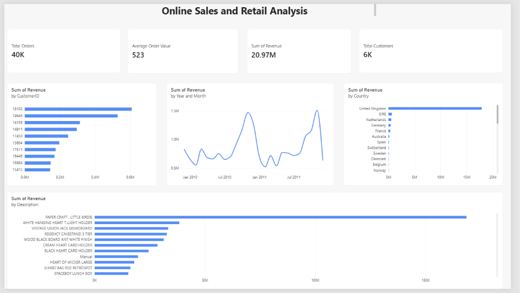

# E-Commerce Customer & Revenue Analysis

## Project Overview

This project analyzes over **1 million e-commerce transactions** to understand revenue performance, customer purchasing behavior, product performance, geographic sales distribution, and monthly sales trends.

The project focuses primarily on **SQL-based data cleaning and analysis**, with **Power BI** used to visualize the final results and key business metrics.

## Tools & Technologies

- **MySQL** – Data cleaning, transformation, and business analysis
- **MySQL Workbench** – Database management and SQL querying
- **Power BI** – Data visualization and dashboard development
- **DAX** – KPI and measure calculations
- **GitHub** – Project documentation and version control

## Dataset

The project uses the **Online Retail II** dataset containing transactions from a UK-based online retailer between **December 2009 and December 2011**.

The raw dataset contains approximately **1.06 million transaction records** with information including:

- Invoice
- Product / Stock Code
- Product Description
- Quantity
- Invoice Date
- Price
- Customer ID
- Country

## Data Cleaning & Preparation

SQL was used to investigate and prepare the raw transaction data.

Key data-quality checks included:

- Identifying missing Customer IDs
- Checking missing product descriptions
- Identifying cancelled invoices
- Investigating negative quantities
- Checking zero and negative prices
- Identifying duplicate transactions
- Validating the transaction date range
- Converting invoice dates into a usable date format
- Creating a **Revenue** field using `Quantity × Price`

A cleaned transaction table was then created for analysis using valid positive sales transactions.

## SQL Analysis

SQL queries were used to answer key business questions, including:

- What is the total revenue generated?
- How many unique orders were placed?
- What is the average order value?
- How many unique customers purchased?
- How does revenue change month by month?
- Who are the highest-value customers?
- Which products generate the most revenue?
- Which countries generate the most revenue?
- How can customers be segmented based on spending?

The analysis includes SQL concepts such as:

- Aggregations
- `GROUP BY`
- `ORDER BY`
- `CASE WHEN`
- Subqueries
- Common Table Expressions (CTEs)
- Window Functions
- `NTILE()`

## Key KPIs

| KPI | Result |
| --- | ---: |
| Total Revenue | 20.97M |
| Total Orders | 40K |
| Average Order Value | 523 |
| Total Customers | 6K |

## Power BI Dashboard

The cleaned MySQL dataset was connected to Power BI to create an interactive analytical dashboard.

The dashboard includes:

- Total Revenue
- Total Orders
- Average Order Value
- Total Customers
- Monthly Revenue Trend
- Top Customers by Revenue
- Top Products by Revenue
- Revenue by Country

## Key Insights

- The **United Kingdom dominates overall revenue**, significantly exceeding other countries.
- Revenue shows noticeable fluctuations and seasonal peaks across the analysis period.
- A relatively small group of high-value customers contributes substantial revenue.
- Product revenue is concentrated among several high-performing products.
- Customer and transaction-level analysis can help identify valuable customer segments and purchasing patterns.

## Project Files

- `ecommerce_analysis.sql` – SQL data cleaning and analysis queries
- `Ecommerce_Customer_Revenue_Analysis.pbix` – Power BI project
- `dashboard.png` – Dashboard preview

## Skills Demonstrated

**SQL | MySQL | Data Cleaning | Data Analysis | CTEs | Window Functions | Customer Analysis | Revenue Analysis | Power BI | DAX | Data Visualization**

